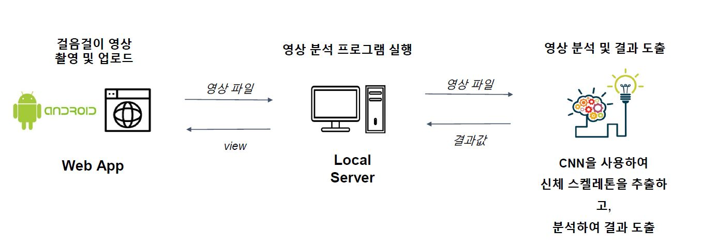
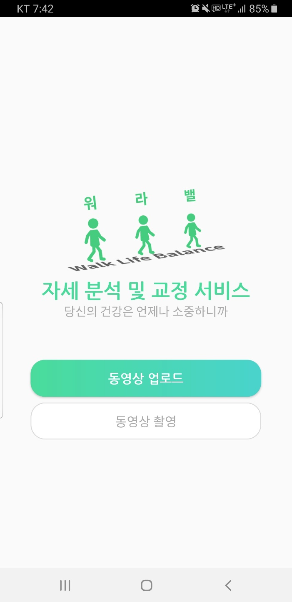
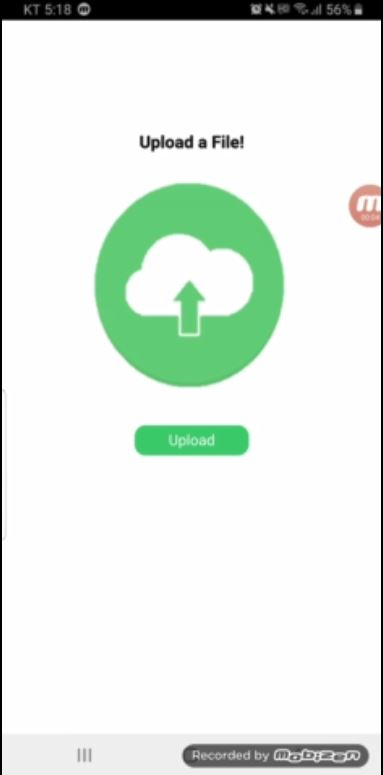
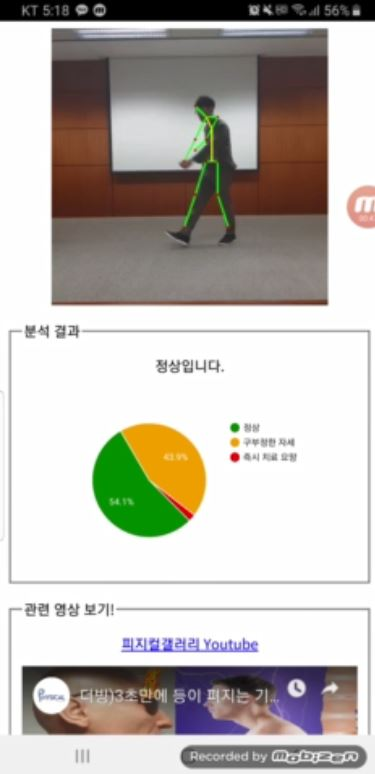

# Gait-Analytics-Application
사람의 걸음걸이를 분석하여 자세 교정 및 치매를 예측하는 안드로이드 애플리케이션

## 1. Project Overview 
+ ### Background 
  * 스마트폰, PC의 보급과 더불어 한 자세로 오랫동안 공부나 업무를 보는 현대인의 특성상 잘못된 자세로 인한 질병이 증가하고 있는 추세
  * 불량한 자세는 특정 질병 외에도 일상 생활을 불편하게 하는 어깨결림, 두통, 소화불량 등 여러 증상 및 통증을 수반
  * 걸음걸이의 형태를 분석하면 평소에 불량한 자세를 취하고 있음을 알 수 있음
  * 이를 통해 사용자에게 바른 자세를 유도하기 위해 걸음걸이 자세를 분석하고 교정하는 서비스를 개발
+ ### Project Goal
  - 사용자의 걸음걸이를 촬영하여 서버에 업로드
  - 올바른 자세인지 분석 후, 결과화면을 웹과 앱으로 제공
  
## 2. Development environment
+ ### Server
  * Win 10
  * RAM : 16 GB
+ ### Client
  * Android 7.0
  * target API Version : 27
  * Compile API Version : 27
  * minSDK version : 21
  
## 3. Language/DB
+ ### Server
  * PHP
  * JSP
+ ### Client
  * Android java 

## 4. Work Flow & Design
+ ### Work Flow
   
+ ### Design
   
   
   
   
## 5. Function Description
+ ### App, Web - Client
  * 사용자는 스마트폰을 이용해 걸음걸이를 촬영합니다.
  * 분석을 원하는 동영상을 선택하여 서버에 업로드 합니다.
  * 결과 화면을 웹과 앱으로 동시에 받아 볼 수 있습니다.
+ ### Web - Server
  * 사용자가 업로드한 동영상을 영상 분석 프로그램으로 분석합니다.
  * Human Pose Estimation 이 적용된 영상을 결과화면에 같이 출력합니다.
  * 분석 결과를 웹으로 출력합니다.
+ ### Analysis
  * cnn을 이용한 Human Pose Estimation을 진행합니다.
  * COCO model을 사용하여 사용자의 뼈대를 추출하면 뼈대의 벡터를 이용해 각을 연산합니다.
  * 연산된 각도를 통해 구부정한 자세를 찾아냅니다.

## 6. Docs & Video
+ ### Docs
  * [Report](doc/report.pptx)
  * [PPT](doc/final.pdf)
+ ### Video
  * [URL](https://www.youtube.com/watch?v=f7sxq7GstLY&feature=youtu.be)
